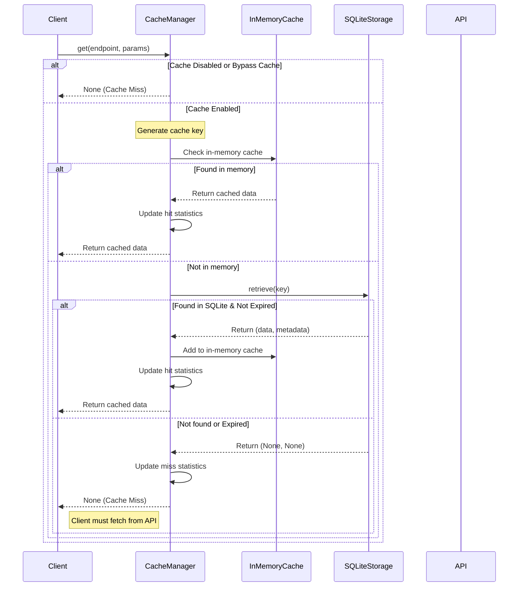
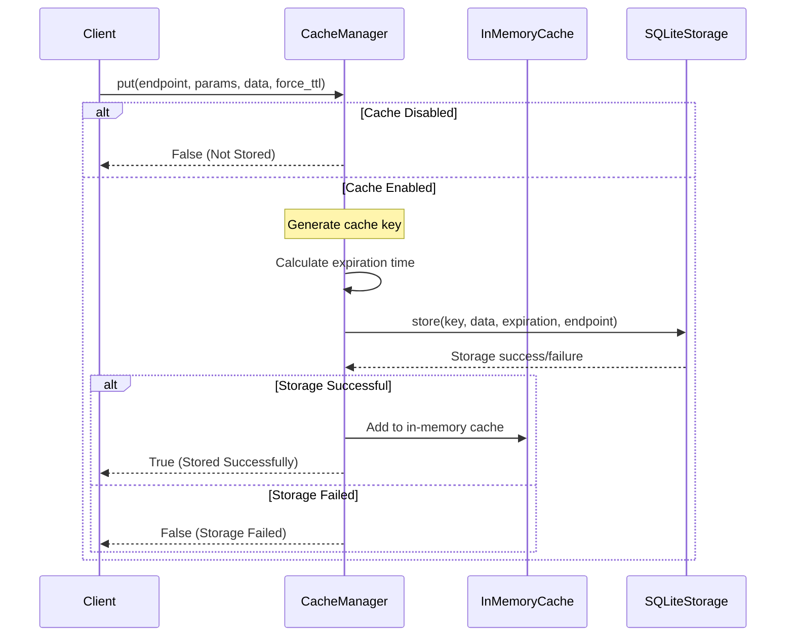
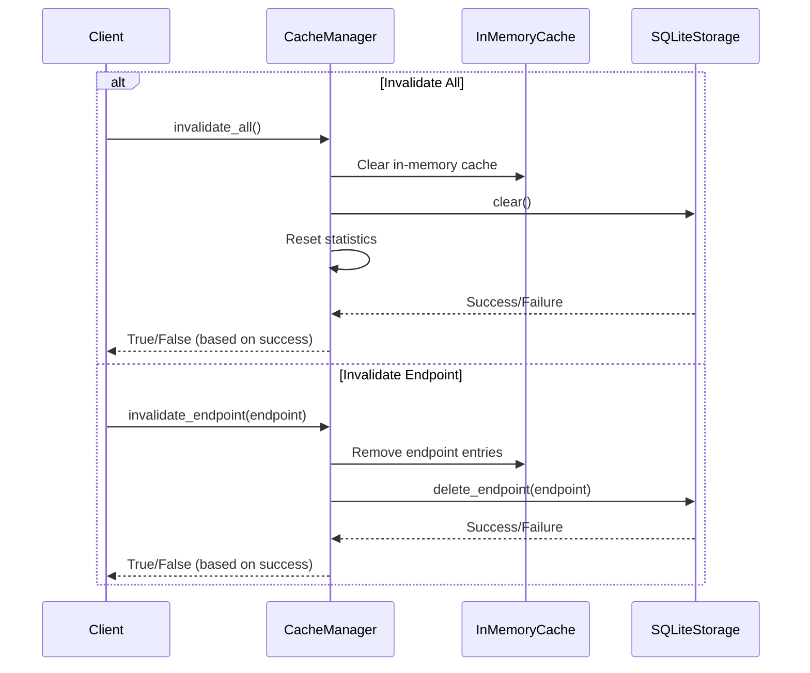

# Cache Architecture Documentation

## Overview

The P123 API Client implements a robust caching system to improve performance and reduce API request load. The caching architecture uses a layered approach with an in-memory cache for fast access and a SQLite database for persistent storage.

## Core Components

### CacheManager

The central controller for all caching operations. It provides a high-level interface for storing and retrieving data, managing cache expiration, and tracking statistics.

### Storage Implementations

1. **SQLiteStorage**: Persistent storage backed by SQLite database
2. **SimpleStorage**: In-memory dictionary-based cache implementation

### CacheConfig

Configuration object that controls cache behavior including:
- Enabling/disabling the cache
- Database path
- Cache refresh time
- Time zone settings
- Statistics tracking
- In-memory cache size limits

## Sequence Diagrams

### Cache Retrieval Flow



### Cache Storage Flow



### Cache Invalidation Flow



## Data Flow

1. **Cache Key Generation**: Creates a unique key based on the endpoint and parameters
2. **Data Serialization**: Data is pickled for storage to handle complex data types
3. **Storage Process**: Data is stored in both SQLite database and in-memory cache
4. **Retrieval Process**: First checks in-memory cache, then falls back to SQLite
5. **Expiration Handling**: Checks TTL before returning cached data

## Technical Implementation Details

### SQLite Schema

```sql
CREATE TABLE IF NOT EXISTS cache_entries (
    key TEXT PRIMARY KEY,
    data BLOB,
    expiration TEXT,
    endpoint TEXT,
    created TEXT
);

CREATE INDEX IF NOT EXISTS endpoint_idx ON cache_entries (endpoint);
```

### In-Memory Cache Implementation

The in-memory cache is implemented as an OrderedDict with an LRU (Least Recently Used) eviction policy. When the cache exceeds the configured size limit, the oldest entries are removed first.

### Thread Safety

The SQLiteStorage implementation maintains connection pools to ensure thread safety:

```python
def _get_connection(self):
    """Get a thread-local connection to the database."""
    tid = threading.get_ident()
    if tid not in self._connection_pool:
        conn = sqlite3.connect(self.db_path)
        conn.row_factory = sqlite3.Row
        self._connection_pool[tid] = conn
        self._initialize_db(conn)
    return self._connection_pool[tid]
```

### Expiration Management

Entries are expired based on their TTL (Time To Live):

1. **On Storage**: Each entry is stored with an ISO-formatted expiration timestamp
2. **On Retrieval**: The current time is compared with the expiration time
3. **Bulk Cleanup**: A separate method can remove all expired entries at once

## Performance Considerations

1. **Layered Caching**: In-memory cache for fastest access with SQLite as a backing store
2. **Size Limits**: Configurable in-memory cache size to prevent excessive memory usage
3. **Connection Pooling**: Thread-local connections to optimize database access
4. **Indexing**: Database indexes on frequently queried fields
5. **Statistics Tracking**: Monitoring of hit/miss ratios to evaluate effectiveness

## Cache Statistics

The CacheManager tracks:
- Cache hits
- Cache misses
- Hit ratio
- Cache size

## Error Handling

1. **Storage Failures**: Graceful degradation if the database becomes unavailable
2. **Corrupt Data**: Detection of corrupted cache entries and treating them as misses
3. **Database Locking**: Retry mechanisms for concurrent write operations

## Future Enhancements

1. **Cache Warming**: Pre-fetching frequently accessed data
2. **Distributed Caching**: Support for Redis or other distributed cache backends
3. **Advanced Expiration Policies**: Different TTLs based on endpoint or data type
4. **Cache Compression**: Optional compression for large data sets
5. **Webhook-based Invalidation**: External triggers for cache invalidation 