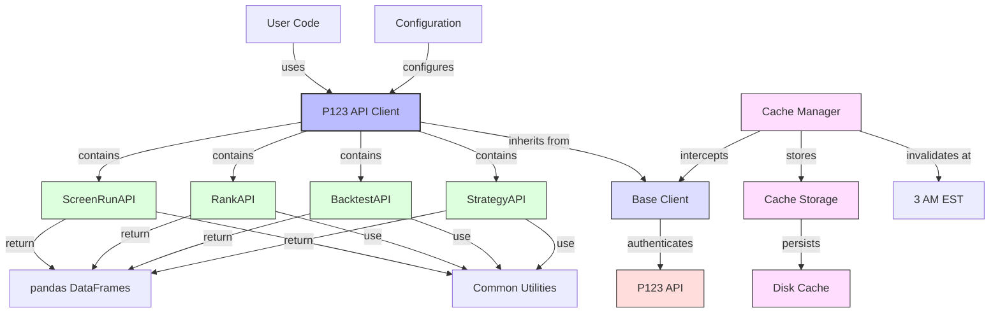
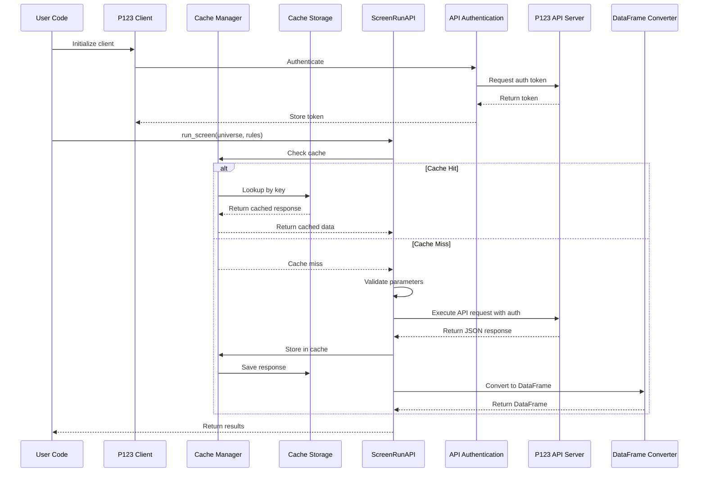

# Architecture for P123 API Client

## Status: Draft

## Technical Summary

The P123 API Client is a Python library designed to provide programmatic access to Portfolio123's API services. It follows a modular architecture with specialized client classes for each API endpoint category. The architecture emphasizes type safety, testability, and pandas integration to enhance the Python data analysis workflow. The system is designed to handle authentication, request formation, response parsing, and error handling in a consistent manner across all API interactions.

## Technology Table

| Technology      | Description                                                   |
| --------------- | ------------------------------------------------------------- |
| Python 3.10+    | Core programming language with typing support                  |
| pandas          | Data manipulation and analysis library for result processing   |
| pydantic        | Data validation and schema definition                          |
| requests        | HTTP client for API interaction                                |
| pytest          | Testing framework                                              |
| VCR.py          | Request recording and playback for reliable testing            |
| mypy            | Static type checking for improved code quality                 |
| ruff            | Python linter and formatter for code quality                   |
| hatchling       | Modern Python packaging and build system                       |
| python-dotenv   | Environment variable management for configuration              |
| logging         | Built-in Python logging module for diagnostics                 |

## Architectural Diagrams





## Data Models

### Screen Run Request Schema

```python
class ScreenDefinition(BaseModel):
    """Screen definition parameters."""
    
    universe: str
    rules: List[str]
    ranking: Optional[Union[str, int, Dict[str, Any]]] = None
    screenType: str = "stock"
    maxResults: Optional[int] = None
    method: Optional[str] = None

class ScreenRunRequest(BaseModel):
    """Screen run request parameters."""
    
    vendor: Optional[str] = None
    pitMethod: Optional[str] = None
    precision: Optional[int] = None
    screen: ScreenDefinition
    asOfDt: Optional[str] = None
    endDt: Optional[str] = None
```

### Screen Run Response Schema

```python
class ScreenRunResponse(BaseModel):
    """Screen run response."""
    
    columns: List[str]
    rows: List[List[Any]]
    cost: float
    quotaRemaining: float
```

### Cache Models

```python
class CacheEntry(BaseModel):
    """Represents a cached API response."""
    
    key: str  # Unique identifier for this cache entry
    data: Any  # The cached API response
    created_at: datetime  # When this entry was created
    expires_at: datetime  # When this entry expires
    access_count: int  # Number of times this entry has been accessed
    
class CacheConfig(BaseModel):
    """Configuration for the caching system."""
    
    enabled: bool = True  # Whether caching is enabled
    ttl_seconds: int = 86400  # Default time-to-live (24 hours)
    max_entries: Optional[int] = None  # Maximum number of entries
    refresh_time: time = time(3, 0, 0)  # 3 AM default refresh time
    timezone: str = "US/Eastern"  # EST by default
    cache_dir: Optional[str] = None  # Custom cache directory
```

## Project Structure

```
p123api_client/
├── __init__.py                # Package exports
├── client.py                  # Base client class
├── common/                    # Shared utilities
│   ├── __init__.py
│   ├── api_client.py          # Generic API client base class
│   ├── auth.py                # Authentication utilities
│   └── errors.py              # Error handling
├── models/                    # Data models
│   ├── __init__.py
│   └── common.py              # Common data models
├── screen_run/                # Screen run API
│   ├── __init__.py
│   ├── screen_run_api.py      # ScreenRunAPI implementation
│   └── schemas.py             # Screen run schemas
├── rank_ranks/                # Ranking API
│   ├── __init__.py
│   ├── rank_api.py            # RankAPI implementation
│   └── schemas.py             # Ranking schemas
├── screen_backtest/           # Backtest API
│   └── ...
├── strategy/                  # Strategy API
│   └── ...
└── util/                      # Helper functions
    ├── __init__.py
    ├── date_utils.py          # Date handling utilities
    └── dataframe_utils.py     # DataFrame conversion utilities
├── cache/                     # Caching system
│   ├── __init__.py
│   ├── manager.py             # Cache manager implementation
│   ├── storage.py             # Storage backends
│   ├── invalidation.py        # Time-based invalidation
│   └── serialization.py       # Data serialization
```

## Change Log

| Change                              | Story ID                                | Description                                                      |
| ----------------------------------- | --------------------------------------- | ---------------------------------------------------------------- |
| Initial Architecture                | N/A                                     | Initial architecture design for P123 API Client                  |
| Add ScreenRunAPI                    | Epic-3-screener-run/story-1            | Implementation of screen run API client with basic functionality  |
| Add DataFrame Conversion            | Epic-3-screener-run/story-3            | Enhanced ScreenRunAPI with pandas DataFrame conversion            |
| Add Historical Screening            | Epic-3-screener-run/story-4            | Support for as-of date and end date parameters                    |
| Add Cache Architecture              | Epic-7-caching/story-1                 | Added caching system to reduce API quota usage                    | 